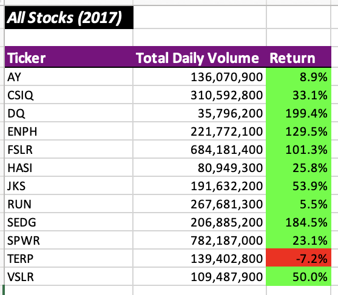
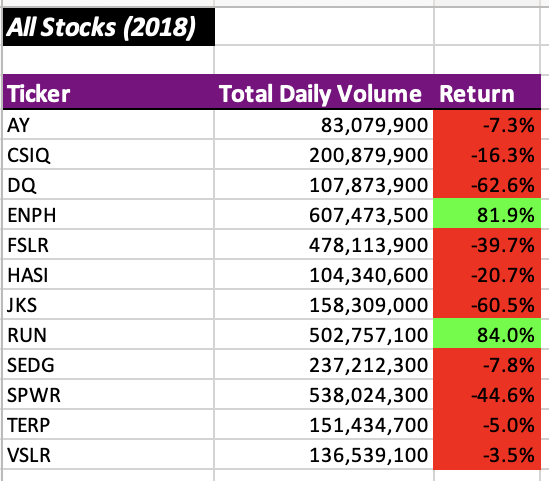
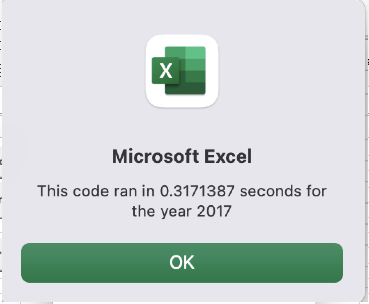
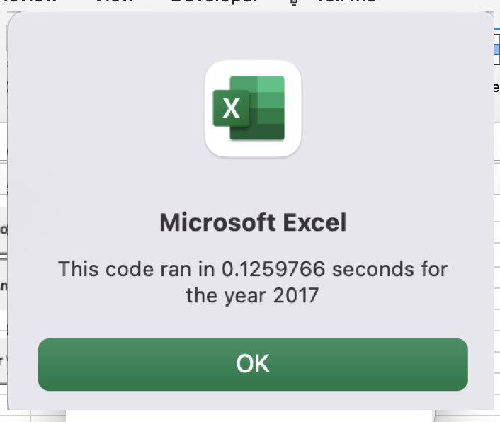
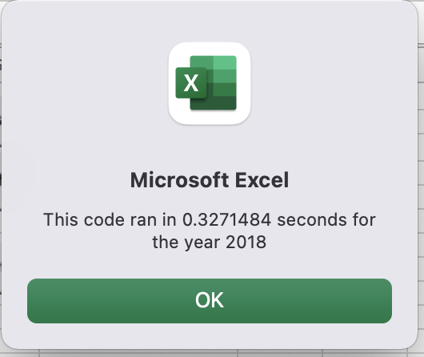
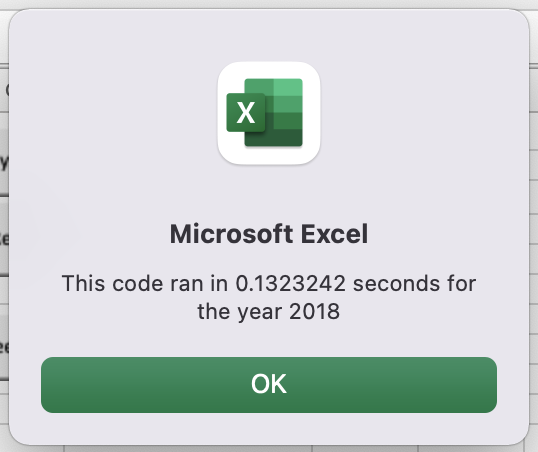

# stock-analysis

## Overview of Project

### Purpose of Analysis

As requested by Steve the purpose of this analysis is to identify in a group 12 stocks of green energy market possible positive investments decisions for Stevens parents, analyzing the years of 2017 and 2018. As Steve wants to expand this research through a large amount of data, on this project we will use VBA tolls of programming in order to apply later in a larger scale of stocks.

## Results

### Analysis of Green Stocks between 2017 and 2018

As a result of the data analysis refined by Return and Volume we have the upcoming Table displayed.

<kbd>
  

</kbd>

Based on this data we can identify a positive yearly return in 2017, with only TERP closing with 7% negative returns, when based on all green energy stocks provided. 
Digging a little dipper, we can see that the stock Steve request analysis for his parents. The DQ stock, in 2017 almost reach the amount of 200% return, indicating that at this period was a great investment but when compared to 2018 we came across a negative return amount of 63%. That considerable amount indicates that DQ stocks are a big risk investment, and it is recommended that when investing in this market Steve and his family disperse the amount invested on more stable stocks such as ENPH or RUN.

## Coding and Refacturing

### Advantages and disadvantages of refactoring code

One of the main advantages of refactoring codes is to make more efficient way to displayed data and reduce the execution time. When applied to a large data a refactor code can provide precise information in record times that cannot be produce through formulas on Excel.

On the opposite way we must look at the disadvantages of refactoring codes when dealing with such specific and planned codes, if one code is misplaced or spelled incorrectly you can damage a long Code work perfectly done at first. As on the development of this project we learned that copy the original code and always save as backup is essential to move further on refactoring codes.

### Applying refactoring on original code

When applying the refactoring codes for this project demanded a lot of detail attention and after a few attempts the most applicable changes that came back with considerable results were change the Loop code, where i placed on the same loop but get all the data in arrays.And no more swiching between worksheets.

#### Original Code Nested Loop

                '5a)Loop through rows.
            Worksheets(yearValue).Activate
            For j = 2 To RowCount
            
                '5b) Get total volume for current ticker.
                If Cells(j, 2).Value = ticker Then
                    TotalVolume = TotalVolume + Cells(j, 9).Value
                End If
                '5c) Find starting price for current ticker.
                If Cells(j - 1, 2).Value <> ticker And Cells(j, 2).Value = ticker Then
                    startingPrice = Cells(j, 7).Value
                End If
                '5c) Find ending price for current ticker.
                If Cells(j + 1, 2).Value <> ticker And Cells(j, 2).Value = ticker Then
                    endingPrice = Cells(j, 7).Value
                End If
                
            Next j
            
            '6) Output data for current ticker.
            Worksheets("All_Stocks_Analysis").Activate
            Cells(4 + i, 1).Value = ticker
            Cells(4 + i, 2).Value = TotalVolume
            Cells(4 + i, 3).Value = endingPrice / startingPrice – 1

#### Refactored Code

      '5b) Create three output arrays.
    Dim tickerVolumes(12) As Long
    Dim tickerStartingPrices(12) As Single
    Dim tickerEndingPrices(12) As Single
    
    
    '6a) Create a for loop and initialize arrays to zero.
    For i = 0 To 11
        tickerVolumes(tickerIndex) = 0
        tickerStartingPrices(tickerIndex) = 0
        tickerEndingPrices(tickerIndex) = 0
    Next i
    
    '6b) Loop over all the rows.
    For i = 2 To RowCount
       
        '7a) Increase volume for current ticker.
        tickerVolumes(tickerIndex) = tickerVolumes(tickerIndex) + Cells(i, 9).Value
        
        
        '7b) Check if the current row is the first row with the selected tickerIndex.
        If Cells(i - 1, 2).Value <> tickers(tickerIndex) And Cells(i, 2).Value = tickers(tickerIndex) Then
            tickerStartingPrices(tickerIndex) = Cells(i, 7).Value
        End If
        
  
        
        '7c) Check if the current row is the last row with the selected ticker.
        If Cells(i + 1, 2).Value <> tickers(tickerIndex) And Cells(i, 2).Value = tickers(tickerIndex) Then
            tickerEndingPrices(tickerIndex) = Cells(i, 7).Value
            
            '7d Increase the tickerIndex.
            tickerIndex = tickerIndex + 1
        End If
    
    Next i
    
    '8) Loop through your arrays to output the Ticker, Total Daily Volume, and Return.
    For i = 0 To 11
        
        '8a) Activate output data worksheet.
        Worksheets("All_Stocks_Analysis").Activate
        Cells(4 + i, 1).Value = tickers(i)
        Cells(4 + i, 2).Value = tickerVolumes(i)
        Cells(4 + i, 3).Value = (tickerEndingPrices(i) / tickerStartingPrices(i)) - 1
        
    Next i

#### Execution Time

With the refactoring code we can clearly see the difference on the execution time as demonstrated on the images.

<kbd>
2017
  

  2018
  

</kbd>

## Final considerations

As per the analysis of this challenge it became clear that after refactoring the original VBA script, we had a comprehensible code also in future analysis of this code if the user tries to apply differences will make easier on readability. As per further analysis I will be checking in to avoid nested loops when not necessary, when became clear that once when we decrease the amount of code under codes, besides avoid errors on typing, we had a great increase on  execution time. Crucial for large amount of analysis.
